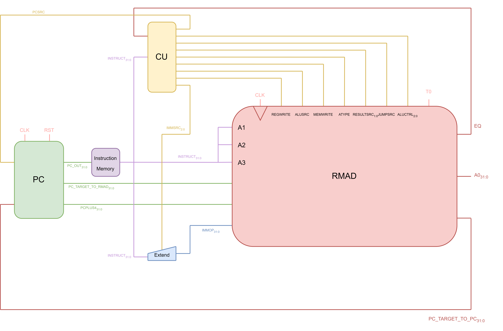

# Alex's Personal Statement #
## Contents ##

1. [My Contributions](#contributions)
2. [The Control Unit](#CU)
3. [Top File](#Top)
4. [Program Counter](#PC)
5. [Testing / Debugging](#Test)
6. [ALU / Register File](#partial)
7. [Top File / Structure (Pipelining)](#Top_P)
8. [Fetch Stage](#Fetch)
9. [Decode Stage](#Decode) 

PUT IN CONTENTS TABLE AT THE END

<div id ="contributions">

## My Contributions: ##

### Single Cycle Processor: ###

- [CU](https://github.com/M-uch/IAC_RISCV32I_Team_23/blob/main/rtl/CU.sv)
- [Top File](https://github.com/M-uch/IAC_RISCV32I_Team_23/blob/main/rtl/Top.sv)
- [PC](https://github.com/M-uch/IAC_RISCV32I_Team_23/blob/main/rtl/PC.sv)
- [Testing/Debugging](https://github.com/M-uch/IAC_RISCV32I_Team_23/tree/main/Test_Evidence)
- [ALU/Register](https://github.com/M-uch/IAC_RISCV32I_Team_23/blob/main/rtl/ALU.sv)

### Pipelined Processor: ###
- [Top File / Structure](https://github.com/M-uch/IAC_RISCV32I_Team_23/blob/Pipeline-Processor/Pipeline_Top/Top.sv)
- [Fetch Stage](https://github.com/M-uch/IAC_RISCV32I_Team_23/blob/Pipeline-Processor/Pipeline_Top/Fetch_stage.sv)
- [Decode Stage](https://github.com/M-uch/IAC_RISCV32I_Team_23/blob/Pipeline-Processor/Pipeline_Top/Decode_stage.sv)

<div id="CU">

## The Control Unit ##

The main methodology behind my CU design was to make the '.sv' files readbable and easy to debug. This would allow my team members to quickly interpret and thus inform their own design choices when they depended upon control signals from the CU.

The component design was split into **2 seperate modules**:

1. The Main Decoder
2. The ALU Decoder

These components form design detailled in the diagram below:


The CU has been decomposed as shown so that we can implement any instruction's appropriate ALU operations seperately from its control signals. Not only does this make the code clearer to read, but also it provides some interesting functionality, allowing us to combine R-Type and I-ALU type instructions using the same 'ALUOp' signal.

**The Main Decoder:**

Here is where the bulk of the signals are assigned, only excluding 'ALUCTRL' and 'ATYPE'. The assignment of these control signals are as follows:

| Instruction Type | RegWrite | ImmSrc | ALUSrc | MemWrite | ResultSrc | Branch | ALUOp | Jump | JumpSrc |
| :--------------: | :------: | :----: | :----: | :------: | :-------: | :----: | :---: | :--: | :-----: |
| Type_R           |     1    |   xxx  |    0   |     0    |     00    |    0   |  000  |   0  |    x    |
| Type_I           |     1    |   001  |    1   |     0    |     01    |    0   |  001  |   0  |    x    |
| Type_I_ALU       |     1    |   001  |    1   |     0    |     00    |    0   |  000  |   0  |    x    |
| Type_S           |     0    |   011  |    1   |     1    |     xx    |    0   |  010  |   0  |    x    |
| Type_B           |     0    |   100  |    0   |     0    |     xx    |    1   |  011  |   0  |    0    |
| Type_U           |     1    |   010  |    1   |     0    |     00    |    0   |  100  |   0  |    x    |
| Type_U_LUI       |     1    |   010  |    1   |     0    |     00    |    0   |  101  |   0  |    x    |
| Type_J_JALR      |     0    |   001  |    0   |     0    |     xx    |    0   |  110  |   1  |    1    |
| Type_J_JAL       |     1    |   101  |    0   |     0    |     10    |    0   |  111  |   1  |    0    | 

This is implemented using a 'command code', which allows for quick and easy modification of control signals during the debugging process.

```
// Define Control Code
// takes form x_xxx_x_x_xx_x_xxx_x_x

logic [13:0] command_code;
assign {reg_write, imm_src, alu_src, mem_write, result_src, branch, alu_op, jump, jump_src} = command_code;

always_comb begin
    Instruction_Type opcode = op;

    case(opcode)

        Type_R:         command_code = 14'b1_xxx_0_0_00_0_000_0_x ;
        Type_I:         command_code = 14'b1_001_1_0_01_0_001_0_x ;
        Type_I_ALU:     command_code = 14'b1_001_1_0_00_0_000_0_x ;
        Type_S:         command_code = 14'b0_011_1_1_xx_0_010_0_x ;
        Type_B:         command_code = 14'b0_100_0_0_xx_1_011_0_0 ;
        Type_U:         command_code = 14'b1_010_1_0_00_0_100_0_x ;
        Type_U_LUI:     command_code = 14'b1_010_1_0_00_0_101_0_x ; 
        Type_J_JALR:    command_code = 14'b0_001_0_0_xx_0_110_1_1 ;
        Type_J_JAL:     command_code = 14'b1_101_0_0_10_0_111_1_0 ; 
        default:        command_code = 14'bx_xxx_x_x_xx_x_xxx_x_x ;

    endcase
end
```

**The ALU Decoder:**

Recieving the ALUOp signal from The Main Decoder, we can now assign the appropriate ALU operations to instructions. Due to our use of a limited set of instructions we can simply implement entire instruction types in a single line. We also combine the Type_R and Type_I_ALU instructions.

The table below details the 'ALUCtrl' and 'AType' signals based on the instruction type:

| Instruction Type | ALUCtrl | 
| :--------------: | :-----: | 
| Type_I           |   000   | 
| Type_S           |   000   | 
| Type_B           |   001   | 
| Type_U           |   000   | 
| Type_U_LUI       |   011   | 
| Type_J_JALR      |   000   | 
| Type_J_JAL       |   000   | 

And for the signal 'AType', we look only at I and S instructions, refering to store and load instructions:

| Instruction Type | funct3  | AType  | Instruction |
| :--------------: | :----:  | :---:  | :---------: |
| Type_I           |  100    |   1    |    lbu      |
|                  |otherwise|   0    |    lw       | 
| Type_S           |  000    |   1    |    sb       |
|                  |otherwise|   0    |    sw       | 

*Note: If AType is 1 then we use byte addressing, 0 is word addressing*    

We note that for 'Type_R' and 'Type_I_ALU' instructions, the 'ALUCtrl' signals depend on funct3 (as well as op[5] and funct7[5]):

| funct3 | op[5] : funct7[5] | ALUCtrl | ALU Instruction |
| :----: | :---------------: | :-----: | :-------------: |
|  000   |  00, 01 or 10     |   000   |  add            | 
|  000   |    11             |   001   |  sub            |
|  001   |     x             |   010   |  sll            | 
|  010   |     x             |   xxx   |  slt (unsused)  | 
|  011   |     x             |   xxx   |  sltu (unused)  | 
|  100   |     x             |   100   |  xor            | 
|  101   |     x             |   101   |  slr            | 
|  110   |     x             |   110   |  or             | 
|  111   |     x             |   111   |  and            | 

*Note: For these 2 instruction types, 'AType' does not matter.*

This has been implemented as follows:
```
    Type_RIALU: begin
        case(funct3)

            3'b000: alu_ctrl = (test == 2'b11) ? 3'b001 : 3'b000;    // if test is 11 then sub, otherwise add
            3'b001: alu_ctrl = 3'b010;                                // sll
            3'b010: alu_ctrl = 3'bxxx;                                // slt unassigned
            3'b011: alu_ctrl = 3'bxxx;                                // sltu unassigned
            3'b100: alu_ctrl = 3'b100;                                // xor
            3'b101: alu_ctrl = 3'b101;                                // slr
            3'b110: alu_ctrl = 3'b110;                                // or
            3'b111: alu_ctrl = 3'b111;                                // and

        endcase
```
**Control Signals Breakdown:**

Below is a table detailling what each control signal is responsible for:

| Control Signal | Description / Responsibility of Control Signal | 
| :------------: | :--------------------------------------------: | 
| PCSrc          | Selects between PC offset or PC + 4            | 
| ResultSrc      | Selects ALU O/P, DataMem or Ra                 | 
| MemWrite       | Write signal for DataMem                       | 
| ALUCtrl        | Select ALU instruction                         | 
| ALUSrc         | Select register or imm into ALU                | 
| ImmSrc         | Select sign extend behavior                    | 
| RegWrite       | Write signal for RegFile                       |
| JumpSrc        | Determine whether JAL or JALR                  |
| AType          | Determine whether byte or word addressing      |

<div id="Top">

## Top File ##

Designing and construction of the Top file included a lot of debugging and house keeping. This meant solving errors and warnings here and there, those of note will be mentioned in the 'Testing/Debugging' and the 'ALU/Register File' section.

Another consideration included in the top file was the naming convention of having all top signals in all captial letters. This was designed to make it easy to distinguish between the layers of the abstraction in the CPU and helped with out decomposition overall.

Below is a diagram detailling the abstracted scope of the top file:



<div id ="PC">

## PC ##

The PC was mostly unchanged from the design I implemented in Lab 4, however slight changes were made so that we could implement 'JALR' logic, this meant storing PC+4 when we perform a JAL instruction and then also allowing use of the PC_Target signal. This was used to implement a mux which chooses between PC_Target (on branches), or the value stored in Ra (on return instructions).

Below are the changes:

```
    // Changes have been marked:

    module PC#(
        parameter WIDTH = 32
    )(
        input  logic                     clk,
        input  logic                     rst,
        input  logic    [WIDTH-1:0]      PC_TargetI,   // NEW: Result from ret mux                    
        input  logic                     PCsrc,        // select for mux
        input  logic    [WIDTH-1:0]      ImmOp,        // imm offset
        output logic    [WIDTH-1:0]      PC_out,       // PC Counter
        output logic    [WIDTH-1:0]      PC_Plus4,     // NEW: PC + 4 (for return address)
        output logic    [WIDTH-1:0]      PC_TargetO    // NEW: PC Target (for ret mux)
    );

        logic [WIDTH-1:0]   next_PC;                    // result from select line

        assign PC_TargetO = PC_out + ImmOp;
        assign PC_Plus4 = PC_out + 32'b100;

        // Then instantiated seperate modules... (same as Lab 4)
```

<div id="Test">

## Testing / Debugging  ##

TALK ABOUT VIDEOS, DEBUGGING IN OTHER SECTIONS, LUI TESTING ETC (MAYBE THE GRAPHS IF YOU HAVE TIME)

<div id="partial">

## ALU / Register File ##

These were 2 partial contributions during the development of the single cycle stage. 

1. **ALU**

    I simply modified the structure of Matthew's ALU logic, changing it from if statements to a single case statement. Additionally I ammended the logic for the EQ O/P signal - we were having problems with this during the debugging stage, with respect to branching logic.

    ```
        // Orginal Code:

        always_latch begin
            if(ALUctrl == 3'b000)                                   // add
                {Zero, ALUout} = ALUop1 + ALUop2;
            if(ALUctrl == 3'b001)                                   // sub
                {Zero, ALUout} = ALUop1 - ALUop2;
            if(ALUctrl == 3'b111)                                   // and
                {Zero, ALUout} = ALUop1 & ALUop2;
            if(ALUctrl == 3'b110)                                   // or
                {Zero, ALUout} = ALUop1 | ALUop2;
            if(ALUctrl == 3'b100)                                   // xor
                {Zero, ALUout} = ALUop1 ^ ALUop2;
            if(ALUctrl == 3'b010)                                   // sll
                {Zero, ALUout} = ALUop1 << ALUop2;
            if(ALUctrl == 3'b101)                                   // slr
                {Zero, ALUout} = ALUop1 >> ALUop2;
        end
    ```

    ```
        // My Contribution:
        
        assign Zero = (ALU_Result == 32'b0) ? 1'b1 : 1'b0;  // EQ Logic
        assign ALUout = ALU_Result;

        always_comb begin

            case(ALUctrl)

                3'b000: ALU_Result = ALUop1 + ALUop2; 
                3'b001: ALU_Result = ALUop1 - ALUop2; 
                3'b010: ALU_Result = ALUop1 << ALUop2; 
                3'b011: ALU_Result = ALUop2;
                3'b100: ALU_Result = ALUop1 ^ ALUop2; 
                3'b101: ALU_Result = ALUop1 >> ALUop2;      
                3'b110: ALU_Result = ALUop1 | ALUop2;    
                3'b111: ALU_Result = ALUop1 & ALUop2;

                default: ;
            
            endcase

        end
    ```

2. **Register File**

    During the debugging process we came across issues when performing the unconditional jump instruction in the reference program, where we would write to the zero register. This was therefore ammended with a small addition to the logic.

    ```
        // Orginal Code:
        
        always_ff @(posedge clk) begin
            if(WE3) Reg_File[A3] <= WD3; 
            if(trigger== 1'b1) Reg_File[5] <= 1; // t0 location 
        end
    ```

    ```
        // My Contribution:

        always_ff @(posedge clk) begin
            if(WE3 && (A3 != 5'b00000)) Reg_File[A3] <= WD3;     // new cond avoids writing r[0] on unconditional jumps 
            if(trigger== 1'b1) Reg_File[5] <= 1; // t0 location 
        end
    ```
<div id="Top_P">

## Top File / Structure (Pipelining) ##

My pipeline structure would take the form of a top file connecting the 5 pipeline stages. Below is a diagram detailing this:


The pipeline would be decomposed as follows:

| Pipeline Stage | Modules Included | Stage Purpose |
| :------------: | :--------------- | :------------ |
| Fetch Stage    | PC, Instruction Memory| Get Instruction| 
| Decode Stage   | CU, Register File, Sign Extend | Get Control Signals and Register Data |
| Execute Stage  | ALU, Jump Functionality | Perform ALU/Jump Operations |
| Memory Stage   | Data Memory | Read / Write to Data Memory |
| Writeback Stage| Result Mux | Feedback CPU Result to Register File |

Inside each stage is the pipeline register for the next stage, this means that that when it enters the next pipeline stage it will be a cycle later. This was by design so that connections could be made on top file easily, when it came to I/P signals to the hazard unit.

*Note that the Writeback stage does not include a pipeline register, it is simply a mux*

<div id="Fetch">

## Fetch Stage ##

The Fetch Stage is responsible for outputting instructions for the rest of the pipeline. There were 2 modules which required changing (from the single-cycle versions) for implementation in the pipelined processor:

1. **PC**

    The PC needed to be changed as we required the 'PC Target' calculation to be performed in the Execute stage of the pipeling. This meant the I/O ultimately became a lot simpler as we no longer had a feedback loop between multiple modules.

    ```
        // Original Code:
        module PC#(
            parameter WIDTH = 32
        )(

            input  logic                     clk,
            input  logic                     rst,
            input  logic    [WIDTH-1:0]      PC_TargetI,                      
            input  logic                     PCsrc,        // select for mux
            input  logic    [WIDTH-1:0]      ImmOp,        // imm ofFset
            output logic    [WIDTH-1:0]      PC_out,       // PC Counter
            output logic    [WIDTH-1:0]      PC_Plus4,     // PC + 4 (for return address)
            output logic    [WIDTH-1:0]      PC_TargetO    // PC Target
        );

            // intermediate vals
            logic [WIDTH-1:0]   next_PC;                   // result from select line

            assign PC_TargetO = PC_out + ImmOp;            // NOTE: Calculate in PC
            assign PC_Plus4 = PC_out + 32'b100;

            // Instantiate Modules... 
    ```

    ```
        // Pipeline Modifications:
        module PC_P#(
            parameter WIDTH = 32
        )(

            input  logic                     clk,
            input  logic                     rst,
            input  logic                     en,           // NEW: enable signal
            input  logic    [WIDTH-1:0]      PC_Target,    // NEW: No more feeback loop                 
            input  logic                     PCsrc,        // select for mux
            output logic    [WIDTH-1:0]      PC_out,       // PC Counter
            output logic    [WIDTH-1:0]      PC_Plus4      // PC + 4 (for return address)
        );

            // intermediate vals
            logic [WIDTH-1:0]   next_PC;      // result from select line

            assign PC_Plus4 = PC_out + 32'b100;

            // Instantiate modules...
    ```

2. **PC Register**

    The PC register also needed some modifications. It required a new 'en' signal which was defined as the 'StallF' signal from the Hazard Unit.

    ```
        // Original Code:
        always_ff @ (posedge clk, posedge rst)
            if (rst) PC <= {WIDTH{1'b0}};    // if reset = 1 then PC = 0
            else PC <= next_PC;
    ```

    ```
        // Pipeline Modifications:
        always_ff @ (posedge clk, posedge rst) begin
            if(~en) begin                               // NEW: Stall condition
                if (rst) PC <= {WIDTH{1'b0}};           // if reset = 1 then PC = 0
                else PC <= next_PC;
            end
        end        
    ```

    *Note that the condition is '~en' - therefore only store if there is no stall* 

<div id="Decode">

## Decode Stage ##

The Decode Stage is responsible for providing the control signals, register data and sign extend data for the pipeline. Again there were 2 modules which had to be edited to accomodate the use of pipelining:

1. **CU**

    The Control Unit had to modified so that we would perform the appropriate logical operations to calculate 'PCSrc' (signal which defined our PC input) in the execute phase. This meant we had to change the I/O to now output the 'branch' and 'jump' signals.

    ```
        // Original Code:
        module CU #(
            parameter WIDTH = 32
        ) (
            input logic     [WIDTH-1:0]     instr,   // Instruction
            input logic                     eq,
            output logic                    pc_src,
            output logic    [1:0]           result_src,
            output logic                    mem_write,
            output logic    [2:0]           alu_ctrl,
            output logic                    alu_src,
            output logic    [2:0]           imm_src,
            output logic                    reg_write,
            output logic                    jump_src,
            output logic                    a_type

        );

            logic [2:0] ALUOp;
            logic branch;                               // NOTE: Branch / Jump 
            logic jump;                                 // defined only in CU scope

            assign pc_src = (branch & ~eq) || jump;     // NOTE: Performing in decode

            // Instantiate modules...
    ```

    ```
        // Pipeline Modifications:
        module CU_P #(
            parameter WIDTH = 32
        ) (
            input logic     [WIDTH-1:0]     instr,        // Instruction
            output logic    [1:0]           result_src,
            output logic                    mem_write,
            output logic    [2:0]           alu_ctrl,
            output logic                    alu_src,
            output logic    [2:0]           imm_src,
            output logic                    reg_write,
            output logic                    jump_src,
            output logic                    a_type,
            output logic                    jump,         // NEW: jump and branch now part of I/O
            output logic                    branch

        );

            logic [2:0] ALUOp;

            // Instantiate modules...
    ```

2. **Register File**

    The Register File also needed to be modified to perform its sequential logic on the falling edge rather than the rising edge. This is so we could allow for the the synchronous nature of the pipeline data moving 'downstream'(between pipeline stages), and would avoid unintentionally overwriting any important data.

    ```
        // Original Code:
        always_ff @(posedge clk) begin      // NOTE: On 'posedge'
            if(WE3 && (A3 != 5'b00000)) Reg_File[A3] <= WD3;
            if(trigger== 1'b1) Reg_File[5] <= 1; // t0 location 
        end
    ```

    ```
        // Pipeline Modifications:
        always_ff @(negedge clk) begin      // NEW: On 'negedge'
            if(WE3 && (A3 != 5'b00000)) Reg_File[A3] <= WD3;  
            if(trigger== 1'b1) Reg_File[5] <= 1; // t0 location 
        end
    ```

## Appendix ##

[RISC-V ISA](src/RISC-V_ISA.png)
