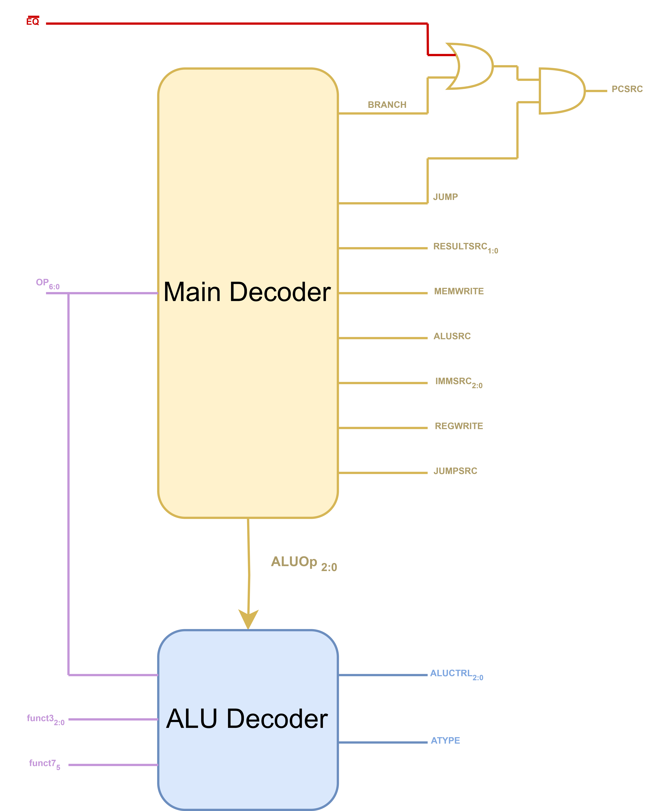

# Alex's Personal Statement #
## Contents ##

1. [My Contributions](#contributions)
2. [The Control Unit](#CU)
3. [Top File](#Top)
4. [Program Counter](#PC)
5. [Testing / Debugging](#Test)
6. [ALU / Register File](#partial) 

PUT IN CONTENTS TABLE AT THE END

## My Contributions: <a name="contributions"></a> ##

### Single Cycle Processor: ###

- CU([link](put in link here))
- Top File([link](put in link here))
- PC([link](put in link here))
- Testing/Debugging([link](put in link here))
- ALU/Register([link](put in link here))

### Pipelined Processor: ###
- x([link](put in link here))
- y([link](put in link here))
- z([link](put in link here))


## The Control Unit <a name="CU"></a> ##

The main methodology behind my CU design was to make the '.sv' files readbable and easy to debug. This would allow my team members to quickly interpret and thus inform their own design choices when they depended upon control signals from the CU.

The component design was split into **2 seperate modules**:

1. The Main Decoder
2. The ALU Decoder

These components form design detailled in the diagram below:



The CU has been decomposed as shown so that we can implement any instruction's appropriate ALU operations seperately from its control signals. Not only does this make the code clearer to read, but also it provides some interesting functionality, allowing us to combine R-Type and I-ALU type instructions using the same 'ALUOp' signal.

**The Main Decoder:**

Here is where the bulk of the signals are assigned, only excluding 'ALUCTRL' and 'ATYPE'. The assignment of these control signals are as follows:

| Instruction Type | RegWrite | ImmSrc | ALUSrc | MemWrite | ResultSrc | Branch | ALUOp | Jump | JumpSrc |
| :--------------: | :------: | :----: | :----: | :------: | :-------: | :----: | :---: | :--: | :-----: |
| Type_R           |     1    |   xxx  |    0   |     0    |     00    |    0   |  000  |   0  |    x    |
| Type_I           |     1    |   001  |    1   |     0    |     01    |    0   |  001  |   0  |    x    |
| Type_I_ALU       |     1    |   001  |    1   |     0    |     00    |    0   |  000  |   0  |    x    |
| Type_S           |     0    |   011  |    1   |     1    |     xx    |    0   |  010  |   0  |    x    |
| Type_B           |     0    |   100  |    0   |     0    |     xx    |    1   |  011  |   0  |    0    |
| Type_U           |     1    |   010  |    1   |     0    |     00    |    0   |  100  |   0  |    x    |
| Type_U_LUI       |     1    |   010  |    1   |     0    |     01    |    0   |  101  |   0  |    x    |
| Type_J_JALR      |     0    |   001  |    0   |     0    |     xx    |    0   |  110  |   1  |    1    |
| Type_J_JAL       |     1    |   101  |    0   |     0    |     10    |    0   |  111  |   1  |    0    | 

This is implemented using a 'command code', which allows for quick and easy modification of control signals during the debugging process.

```
// Define Control Code
// takes form x_xxx_x_x_xx_x_xxx_x_x

logic [13:0] command_code;
assign {reg_write, imm_src, alu_src, mem_write, result_src, branch, alu_op, jump, jump_src} = command_code;

always_comb begin
    Instruction_Type opcode = op;

    case(opcode)

        Type_R:         command_code = 14'b1_xxx_0_0_00_0_000_0_x ;
        Type_I:         command_code = 14'b1_001_1_0_01_0_001_0_x ;
        Type_I_ALU:     command_code = 14'b1_001_1_0_00_0_000_0_x ;
        Type_S:         command_code = 14'b0_011_1_1_xx_0_010_0_x ;
        Type_B:         command_code = 14'b0_100_0_0_xx_1_011_0_0 ;
        Type_U:         command_code = 14'b1_010_1_0_00_0_100_0_x ;
        Type_U_LUI:     command_code = 14'b1_010_1_0_01_0_101_0_x ; 
        Type_J_JALR:    command_code = 14'b0_001_0_0_xx_0_110_1_1 ;
        Type_J_JAL:     command_code = 14'b1_101_0_0_10_0_111_1_0 ; 
        default:        command_code = 14'bx_xxx_x_x_xx_x_xxx_x_x ;

    endcase
end
```

**The ALU Decoder:**

Recieving the ALUOp signal from The Main Decoder, we can now assign the appropriate ALU operations to instructions. Due to our use of a limited set of instructions we can simply implement entire instruction types in a single line. We also combine the Type_R and Type_I_ALU instructions.

The table below details the 'ALUCtrl' and 'AType' signals based on the instruction type:

| Instruction Type | ALUCtrl | 
| :--------------: | :-----: | 
| Type_I           |   000   | 
| Type_S           |   000   | 
| Type_B           |   001   | 
| Type_U           |   000   | 
| Type_U_LUI       |   010   | 
| Type_J_JALR      |   000   | 
| Type_J_JAL       |   000   | 

And for the signal 'AType', we look only at I and S instructions, refering to store and load instructions:

| Instruction Type | funct3  | AType  | Instruction |
| :--------------: | :----:  | :---:  | :---------: |
| Type_I           |  100    |   1    |    lbu      |
|                  |otherwise|   0    |    lw       | 
| Type_S           |  000    |   1    |    sb       |
|                  |otherwise|   0    |    sw       | 

*Note: If AType is 1 then we use byte addressing, 0 is word addressing*    

We note that for 'Type_R' and 'Type_I_ALU' instructions, the 'ALUCtrl' signals depend on funct3 (as well as op[5] and funct7[5]):

| funct3 | op[5] : funct7[5] | ALUCtrl | ALU Instruction |
| :----: | :---------------: | :-----: | :-------------: |
|  000   |  00, 01 or 10     |   000   |  add            | 
|  000   |    11             |   001   |  sub            |
|  001   |     x             |   010   |  sll            | 
|  010   |     x             |   xxx   |  slt (unsused)  | 
|  011   |     x             |   xxx   |  sltu (unused)  | 
|  100   |     x             |   100   |  xor            | 
|  101   |     x             |   101   |  slr            | 
|  110   |     x             |   110   |  or             | 
|  111   |     x             |   111   |  and            | 

*Note: For these 2 instruction types, 'AType' does not matter.*

This has been implemented as follows:
```
    Type_RIALU: begin
        case(funct3)

            3'b000: alu_ctrl = (test == 2'b11) ? 3'b001 : 3'b000;    // if test is 11 then sub, otherwise add
            3'b001: alu_ctrl = 3'b010;                                // sll
            3'b010: alu_ctrl = 3'bxxx;                                // slt unassigned
            3'b011: alu_ctrl = 3'bxxx;                                // sltu unassigned
            3'b100: alu_ctrl = 3'b100;                                // xor
            3'b101: alu_ctrl = 3'b101;                                // slr
            3'b110: alu_ctrl = 3'b110;                                // or
            3'b111: alu_ctrl = 3'b111;                                // and

        endcase
```
**Control Signals Breakdown:**

Below is a table detailling what each control signal is responsible for:

| Control Signal | Description / Responsibility of Control Signal | 
| :------------: | :--------------------------------------------: | 
| PCSrc          | Selects between PC offset or PC + 4            | 
| ResultSrc      | Selects ALU O/P, DataMem or Ra                 | 
| MemWrite       | Write signal for DataMem                       | 
| ALUCtrl        | Select ALU instruction                         | 
| ALUSrc         | Select register or imm into ALU                | 
| ImmSrc         | Select sign extend behavior                    | 
| RegWrite       | Write signal for RegFile                       |
| JumpSrc        | Determine whether JAL or JALR                  |
| AType          | Determine whether byte or word addressing      |

## Top File <a name="Top"></a> ##

Designing and construction of the Top file included a lot of debugging and house keeping. This meant solving errors and warnings here and there, those of note will be mentioned in the 'Testing/Debugging' and the 'ALU/Register File' section.

Another consideration included in the top file was the naming convention of having all top signals in all captial letters. This was designed to make it easy to distinguish between the layers of the abstraction in the CPU and helped with out decomposition overall.

INSERT SIMPLIFIED TOP FILE DIAGRAM HERE

## PC <a name="PC"></a> ##

The PC was mostly unchanged from the design I implemented in Lab 4, however slight changes were made so that we could implement 'JALR' logic, this meant storing PC+4 when we perform a JAL instruction and then also allowing use of the PC_Target signal. This was used to implement a mux which chooses between PC_Target (on branches), or the value stored in Ra (on return instructions).

Below are the changes:

```
    // Changes have been marked:

    module PC#(
        parameter WIDTH = 32
    )(
        input  logic                     clk,
        input  logic                     rst,
        input  logic    [WIDTH-1:0]      PC_TargetI,   // NEW: Result from ret mux                    
        input  logic                     PCsrc,        // select for mux
        input  logic    [WIDTH-1:0]      ImmOp,        // imm offset
        output logic    [WIDTH-1:0]      PC_out,       // PC Counter
        output logic    [WIDTH-1:0]      PC_Plus4,     // NEW: PC + 4 (for return address)
        output logic    [WIDTH-1:0]      PC_TargetO    // NEW: PC Target (for ret mux)
    );

        logic [WIDTH-1:0]   next_PC;                    // result from select line

        assign PC_TargetO = PC_out + ImmOp;
        assign PC_Plus4 = PC_out + 32'b100;

        // Then instantiated seperate modules... (same as Lab 4)
```

## Testing / Debugging <a name="Test"></a> ##


## ALU / Register File <a name="partial"></a> ##

These were 2 partial contributions during the development of the single cycle stage. 

1. **ALU**

    I simply modified the structure of Matthew's ALU logic, changing it from if statements to a single case statement. Additionally I ammended the logic for the EQ O/P signal - we were having problems with this during the debugging stage, with respect to branching logic.

    ```
        // Orginal Code:

        always_latch begin
            if(ALUctrl == 3'b000)                                   // add
                {Zero, ALUout} = ALUop1 + ALUop2;
            if(ALUctrl == 3'b001)                                   // sub
                {Zero, ALUout} = ALUop1 - ALUop2;
            if(ALUctrl == 3'b111)                                   // and
                {Zero, ALUout} = ALUop1 & ALUop2;
            if(ALUctrl == 3'b110)                                   // or
                {Zero, ALUout} = ALUop1 | ALUop2;
            if(ALUctrl == 3'b100)                                   // xor
                {Zero, ALUout} = ALUop1 ^ ALUop2;
            if(ALUctrl == 3'b010)                                   // sll
                {Zero, ALUout} = ALUop1 << ALUop2;
            if(ALUctrl == 3'b101)                                   // slr
                {Zero, ALUout} = ALUop1 >> ALUop2;
        end
    ```

    ```
        // My Contribution:
        
        assign Zero = (ALU_Result == 32'b0) ? 1'b1 : 1'b0;  // EQ Logic
        assign ALUout = ALU_Result;

        always_comb begin

            case(ALUctrl)

                3'b000: ALU_Result = ALUop1 + ALUop2; 
                3'b001: ALU_Result = ALUop1 - ALUop2; 
                3'b010: ALU_Result = ALUop1 << ALUop2; 
                3'b011: ALU_Result = 32'bx;
                3'b100: ALU_Result = ALUop1 ^ ALUop2; 
                3'b101: ALU_Result = ALUop1 >> ALUop2;      
                3'b110: ALU_Result = ALUop1 | ALUop2;    
                3'b111: ALU_Result = ALUop1 & ALUop2;

                default: ;
            
            endcase

        end
    ```

2. **Register File**

    During the debugging process we came across issues when performing the unconditional jump instruction in the reference program, where we would write to the zero register. This was therefore ammended with a small addition to the logic.

    ```
        // Orginal Code:
        
        always_ff @(posedge clk) begin
            if(WE3) Reg_File[A3] <= WD3; 
            if(trigger== 1'b1) Reg_File[5] <= 1; // t0 location 
        end
    ```

    ```
        // My Contribution:

        always_ff @(posedge clk) begin
            if(WE3 && (A3 != 5'b00000)) Reg_File[A3] <= WD3;     // new cond avoids writing r[0] on unconditional jumps 
            if(trigger== 1'b1) Reg_File[5] <= 1; // t0 location 
        end
    ```
## Appendix ##

[RISC-V ISA](src/RISC-V_ISA.png)
